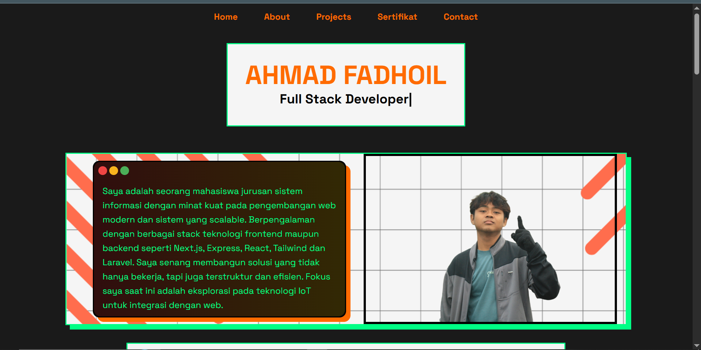

# 🌐 Ahmad Fadhoil — Portfolio Website

Ini adalah website portofolio pribadi saya yang menampilkan proyek-proyek terbaru, sertifikat, dan informasi kontak. Dibangun dengan stack modern seperti Vite, React, Tailwind CSS, dan Framer Motion.

## 🚀 Tech Stack

- ⚡ Vite
- ⚛️ React
- 🎨 Tailwind CSS
- 🎞️ Framer Motion
- 📦 Deployed on Netlify

## ✨ Fitur Utama

- Desain NeoBrutalism yang unik dan interaktif
- Animasi masuk saat scroll (Intersection Observer + Framer Motion)
- Komponen modular: Sertifikat, Project, TypeWriter
- Responsive design
- SEO-friendly (termasuk custom favicon dan metadata)

## 📷 Preview

